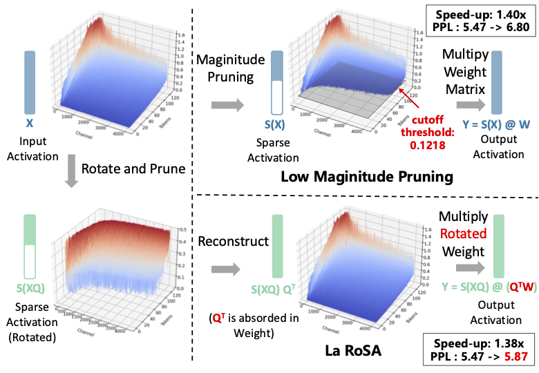
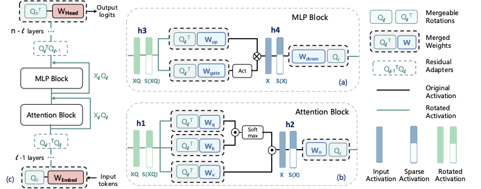

# LaRoSa: Enhancing LLM Efficiency via Layerwise Rotated Sparse Activation



## 🎯 Overview
LaRoSa is a sophisticated framework that applies **rotation-based topk activation sparsification** to LLM, which reduces computational costs while maintaining model performance.

### Key Innovations
- **Rotation-based Sparsification**: Advanced compression techniques for model serving
- **Multi-model Support**: Compatible with Llama2/3, Qwen2/2.5 

## 📁 Project Structure

```
LAROSA/
├── inference/         # Sparse model implementations
├── gen_act/           # Activation analysis tools
├── utils/             # Core utilities and evaluation
├── scripts/           # PPL calculation scripts
└── README.md
```

### Key Components



#### 1. **Sparse Model Implementations** (`inference/`)
- **LaRosaModel Classes and Sparse Operations**:
  - `SparseMLP`: Top-k activation sparsification in feed-forward layers
  - `SparseSelfAttention`: Efficient sparse attention mechanisms
- **Rotation-based Compression**: Advanced compression using eigenvalue decomposition for deployment

#### 2. **Activation Analysis Pipeline** (`gen_act/`)
- **Rotation Matrix Generation**: Creates compression matrices for enhanced sparsification
  - `grab_acts_rotate_diff_Q_llama.py`: generate layer-wise rotation from Llama models
  - `grab_acts_rotate_diff_Q_qwen.py`: generate layer-wise ratation from Qwen models
- **Statistical Modeling**: Builds histogram distributions and computes eigenvalue decompositions

#### 3. **Core Utilities & Evaluation** (`utils/`)
- **SparsifyFn Class**: Applies top-k sparsification based on learned thresholds
- **Evaluation Tools**: Perplexity calculation and model performance assessment

#### 4. **Testing & Validation** (`test/`)
- **Perplexity Testing**: Dedicated scripts for validating sparse model performance
  - `ppl_test_larosa_llama.py`: Llama model perplexity evaluation
  - `ppl_test_larosa_qwen.py`: Qwen model perplexity evaluation

## 🚀 Quick Start

### Prerequisites

**⚠️ Critical Dependencies**

LaRosa requires specific versions for compatibility:

```bash
pip install transformers==4.46.3
pip install lm-eval==0.4.3
pip install torch datasets pandas numpy
```

**Required Versions:**
- `transformers`: **4.46.3** (critical for model compatibility)
- `lm_eval`: **0.4.3** (required for evaluation framework)
- `torch`: >=2.0.0 (CUDA support recommended)
- `datasets`: >=2.14.0
- `pandas`: >=1.5.0
- `numpy`: >=1.21.0

## 📊 Supported Models

| Model | Architecture | Sparse Version | Notes |
|-------|--------------|----------------|--------|
| Llama | Transformer | ✅ LlamaSparseForCausalLM | Full support |
| Qwen2 | Transformer | ✅ Qwen2SparseForCausalLM | Full support |

## 🧪 Research Workflow
Since LaRoSa requires sparsification operations during inference, we recommend following the workflow below for easy testing and implementation to reproduce the results in our paper. 

### 1. **Download Base Model from Huggingface**
```
from huggingface_hub import snapshot_download

snapshot_download(repo_id="Qwen/Qwen2.5-7B", local_dir="Qwen2.5-7B")
```

### 2. **Generate Rotation Matrix**
```bash
CUDA_VISIBLE_DEVICES=0 
python3 gen_act/grab_acts_rotate_diff_Q_qwen.py --model_name Qwen2.5-7B --output_path qwen2_7b_act_rotate_mlp_and_attn_seperate_Q_wikitext_opensource
```

### 3. **Sparsity Optimization**
Copy and rename the current model Qwen2.5-7B to Qwen2.5-7B-larosa, then copy the following files from the `inference` directory to the new model:

```bash
cp -r Qwen2.5-7B Qwen2.5-7B-larosa
cp inference/qwen_larosa_config.json Qwen2.5-7B-larosa/config.json
cp inference/configuration_qwen.py Qwen2.5-7B-larosa/
cp inference/modeling_qwen2_larosa.py Qwen2.5-7B-larosa/
```

### 4. **Evaluation**
```bash
export CUDA_VISIBLE_DEVICES=0

MODEL_PATH="Qwen2.5-7B-larosa"
OUTPUT_PATH="lm_eval_output/"

# --tasks openbookqa,arc_easy,winogrande,hellaswag,arc_challenge,piqa,boolq,sciq \
accelerate launch -m --main_process_port 12329 lm_eval \
    --model hf \
    --model_args pretrained=$MODEL_PATH,trust_remote_code=True \
    --tasks openbookqa,arc_easy,winogrande,hellaswag,arc_challenge,boolq \
    --batch_size 12 \
    --log_samples \
    --write_out \
    --output_path $OUTPUT_PATH
```

### 5. **Performance Results**
```
|    Tasks    |Version|Filter|n-shot| Metric |   |Value |   |Stderr|
|-------------|------:|------|-----:|--------|---|-----:|---|-----:|
|arc_challenge|      1|none  |     0|acc     |↑  |0.4770|±  |0.0146|
|             |       |none  |     0|acc_norm|↑  |0.5111|±  |0.0146|
|arc_easy     |      1|none  |     0|acc     |↑  |0.7959|±  |0.0083|
|             |       |none  |     0|acc_norm|↑  |0.7673|±  |0.0087|
|boolq        |      2|none  |     0|acc     |↑  |0.8514|±  |0.0062|
|hellaswag    |      1|none  |     0|acc     |↑  |0.5926|±  |0.0049|
|             |       |none  |     0|acc_norm|↑  |0.7822|±  |0.0041|
|openbookqa   |      1|none  |     0|acc     |↑  |0.3320|±  |0.0211|
|             |       |none  |     0|acc_norm|↑  |0.4420|±  |0.0222|
|winogrande   |      1|none  |     0|acc     |↑  |0.7072|±  |0.0128|
```

## 🤝 Contributing

This is a research framework. Contributions welcome for:
- Additional model architectures
- Optimization algorithms
- Evaluation benchmarks
- Documentation improvements

## 📚 Citation

If you use LaRoSa in your research, please cite:

```bibtex
@article{liu2025rosa,
  title={La RoSA: Enhancing LLM Efficiency via Layerwise Rotated Sparse Activation},
  author={Liu, Kai and Xu, Bowen and Wu, Shaoyu and Chen, Xin and Zhou, Hao and Tao, Yongliang and Hu, Lulu},
  journal={arXiv preprint arXiv:2507.01299},
  year={2025}
}
```

## 📝 License
Larosa is an algorithm developed by Alibaba Cloud and licensed under the Apache License (Version 2.0) - see the LICENSE file for details.

## 🙋 FAQ

### Q: What sparsity levels are recommended?
**A**: Start with 25-40% sparsity for most models. 

### Q: Does this work with fine-tuned models?
**A**: Yes, the framework works with any fine-tuned Qwen2/LLaMa3 compatible model.

### Q: Can I use this for training?
**A**: Currently optimized for inference. Training support in development.